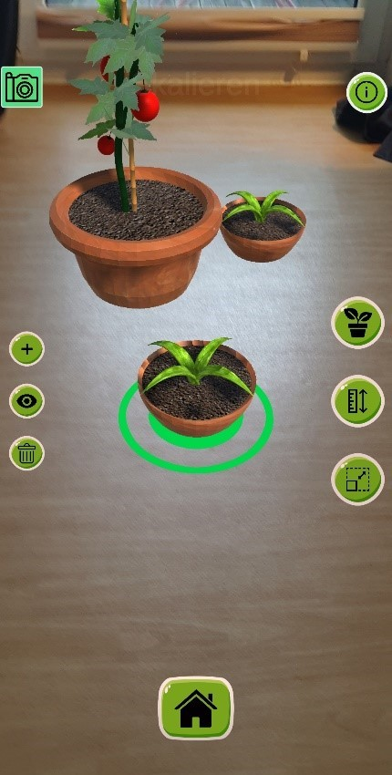

<h1 align="center">WeGreen</h1>

 

  
  
  

    Main menu and AR- feature of the project
  

<!-- ABOUT THE PROJECT -->
## About The Project

This project is an university project about urban gardening. Among other things it provides the functionality to place virtual plants in your appartement or on your balcony. You can check whether you have enough space to get certain plants. Furthermore you can measure the size of AR- plants or change their height. This should help ease your way to grow your own plants and cultivate them.

Here's why:
* Today most people have very little space in big cities
* Growing your own plants can increase the perception of your environment
* Sustainability and a healthy life style become more and more important

(<a href="#top">back to top</a>)

### Built With

* [Unity](https://unity.com/de)
* [ARFoundation](https://unity.com/de/unity/features/arfoundation#:~:text=AR%20Foundation%20umfasst%20Kernfunktionen%20von,App%2DStore%20bereitgestellt%20werden%20k%C3%B6nnen.)
* [Blender](https://www.blender.org/)

(<a href="#top">back to top</a>)

<!-- GETTING STARTED -->
## Getting Started

Clone this repository and open it in Unity. Afterwards you have to build the project on an Android device. You also need ARFoundation and ARCore for Unity.

(<a href="#top">back to top</a>)

<!-- USAGE EXAMPLES -->
## Features

* AR- Feature:     place, measure, resize different plant models
* Reference book:  see importent details about the plants 
* Calender:        set a watering inetrval for your plants 
* Notes:           in app notes function

(<a href="#top">back to top</a>)

<!-- CONTACT -->
## Contact

Justin Max Grothe justinmaxgrothe@gmail.com

(<a href="#top">back to top</a>)

